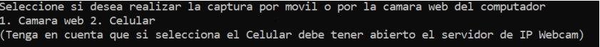

# DIAGNOSTICADOR DE SOMNOLENCIA EN CONDUCTORES
### Luis Guillermo Vélez Segura

#### Desarrollo:

Este proyecto consiste en un sistema diagnosticador de somnolencia en conductores. La mayoría de los accidentes de tráfico se deben a la somnolencia en los conductores. Por ello existe la iniciativa de realizar este proyecto. Nuestra principal herramienta en este proyecto será Python y la ciencia de datos. Utilizaremos paquetes como OpenCV para la detección de rostros y ojos, TensorFlow para el BackEnd, Keras para construir el modelo de clasificación, y por último twilio para enviar el mensaje de alarma al celular del conductor. Este software podrá ser utilizado para evaluar constantemente el cierre de los ojos en un conductor que ya se encuentre en movimiento en su medio de transporte y enviar un mensaje de texto como señal de alerta al celular en caso de ser necesario.
#### Paquetes Requeridos
Este Proyecto fue desarrollado en la versión de Python 3.9.7 y con las siguientes librerías:
- Tensorflow versión (2.5.0).
- Keras versión(2.5.0rc0).
- Twilio versión (6.63.0).
- Pygame versión (2.0.1).
- Numpy versión (1.19.5).
- Opencv-python versión (4.5.3.56).

#### Funcionamiento
Para iniciar nuestra detección de somnolencia nos dirigiremos por la consola de comandos a la ubicación de nuestro proyecto y colocamos Python “drowsiness detection.py”
```sh
Python “drowsiness detection.py”
```
Inmediatamente después de esto aparecera nuestro menú en donde se nos pedira si queremos iniciar el diagnosticador desde la camara web de nuestro pc o  en nuestro célular.

##### Diagnosticador PC
Una vez escogemos la opción del pc , el programa activara nuestra camara web e iniciara el diagnosticador.


##### Diagnosticador Celular
Si queremos realizar el monitoreo a través del celular, debemos tener instalada la aplicación IP Webcam y así utilizar nuestro teléfono como una cámara web. Antes de colocar la opcion de realizar el diágnostico por movil, entramos a la aplicación IP Webcam y debemos iniciar el servidor, copiar la ruta del servidor y reemplazarla en la siguiente línea del arhcivo "drowsiness detection.py"
```python
cap = cv2.VideoCapture("http://192.168.1.107:8080/video")
```


Ya con esto convertimos nuestro télefono en una cámara web, y ahora si podemos proceder a realizar la detección a través del movil.


